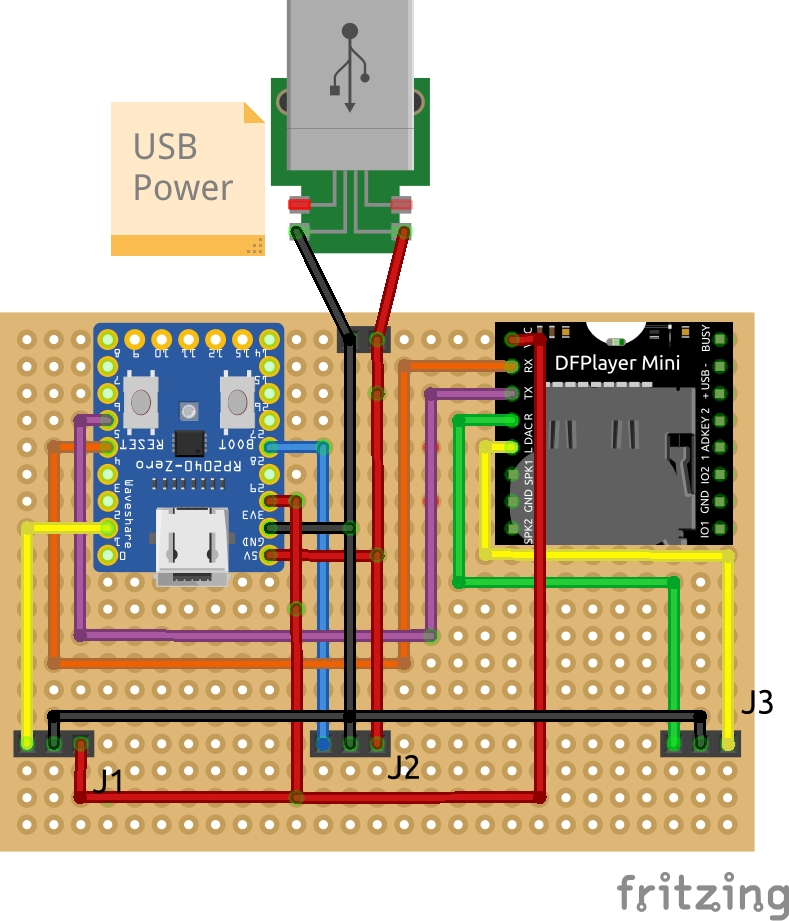
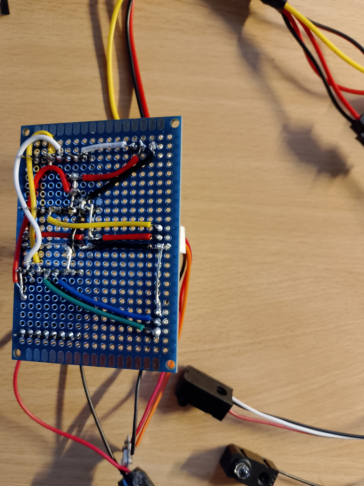
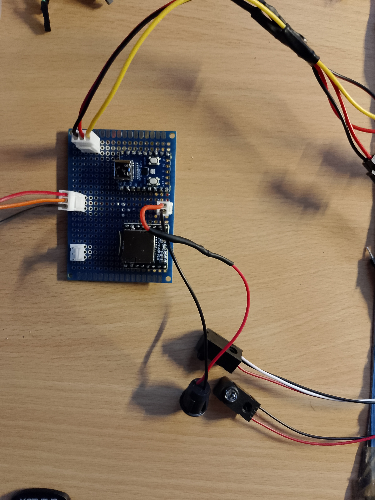
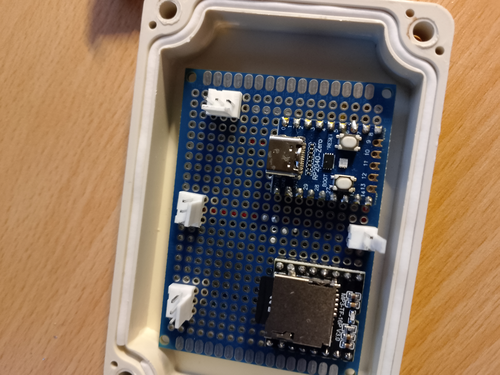
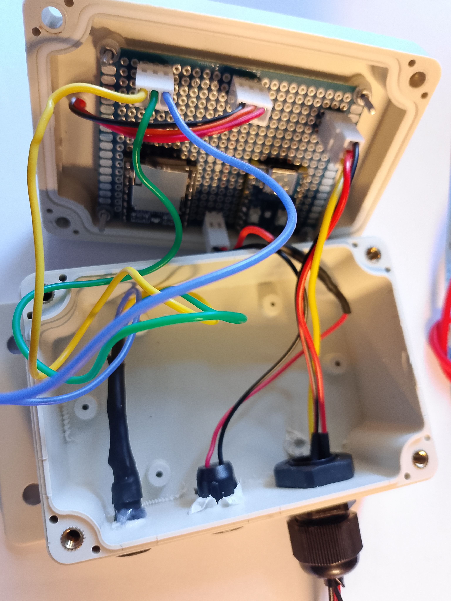
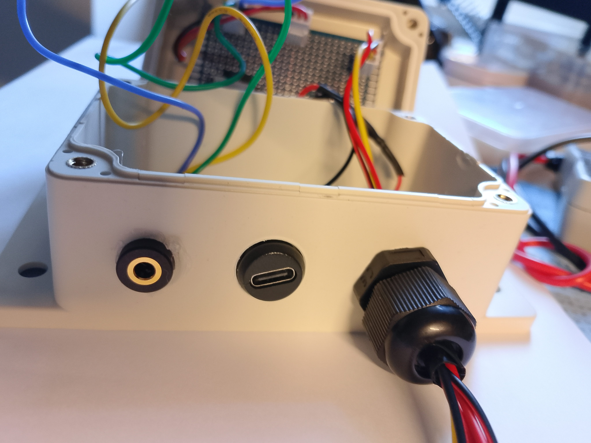

# trigger-tune
Open-source audio player triggered by light beams

## Table of Contents
## Table of Contents
1. [Components](#components)
2. [Wiring Diagram](#wiring-diagram)
3. [Firmware Details](#firmware-details)
4. [DFPlayer Mini & SD Card Setup](#dfplayer-mini--sd-card-setup)
5. [LED Status Indicators](#led-status-indicators)
6. [How-To](#how-to)
    - [Breadboard Prototyping](#breadboard-prototyping)
    - [Firmware Setup](#firmware-setup)
    - [Important: USB Power Handling](#important-usb-power-handling)
    - [Build Prototype](#build-prototype)
7. [Support me](#support-me)
8. [Third-Party Code and License](#third-party-code-and-license)

## Components
- RP2040 (Zero)
- DFPlayer Mini
- USB Connector
- WS2812 (NeoPixel LED)
- Audio Jack
- Micro SD Card
- Perfboard (5x7cm)
- Connectors / Cables
- Enclosure / Box
- Lightbeam normally open NPN (if other is available, you have to adjust the code. Create a Issue if you have problems here)

## Wiring Diagram

Figure 1: Wiring diagram on the perfboard

- **Connector J1** connects to the light barrier; the wiring will be split later into transmitter and receiver units. Additional light barriers can be wired in parallel here.
- **Connector J2** connects to the external WS2812 LED.
- **Connector J3** connects to the audio jack.

## Firmware Details
The firmware is written in **MicroPython** and utilizes a modified version of the [penguintutor/dfplayermini-pico](https://github.com/penguintutor/dfplayermini-pico) library.

The program continuously **polls the GPIO pin** connected to the light barrier. When triggered, it selects and plays a random MP3 file from the SD card. To ensure variety, the logic includes a mechanism that prevents the same track from being played twice in a row.

### Power Management & Optimization
While the RP2040 supports **Deep Sleep** with GPIO interrupts, this was not implemented. The **DFPlayer Mini** remains the primary power consumer in the circuit, making the power savings from MCU sleep modes negligible for this specific application.

## DFPlayer Mini & SD Card Setup
The DFPlayer Mini requires the SD card to be formatted to **FAT16 or FAT32**.

### SD Card Structure
The module requires a specific file naming convention to function reliably:
- **Folder naming:** Use a folder named `01` in the root directory.
- **File naming:** Files should be prefixed with a three-digit number (e.g., `001.mp3`).

## LED Status Indicators
The WS2812 LED (internal on PIN 16 and (optional) extenal on PIN 28) provides visual feedback on the system's state:

- **White:** System is initializing.
- **Green:** Ready and waiting for light beam trigger.
- **Blue:** Triggered / Playing audio. The LED stays blue for 1 second upon trigger; the song continues to play until the end unless a new trigger occurs during playback.
- **Red:** Error. No SD card detected or no MP3 files found in the specified folder.
- **Yellow:** Obstruction warning. The light beam is being triggered continuously (likely blocked or misaligned).

## How-To

### Breadboard Prototyping
For initial testing, it is recommended to build the circuit on a breadboard first as seen on the wiring diagram.

### Firmware Setup
1. Install **Thonny** IDE on your computer.
2. Flash the **MicroPython firmware** to the RP2040.  
   > **Firmware download:** [MicroPython for RP2040](https://micropython.org/download/rp2-pico/)
3. Copy all files from the `firmware` folder to the RP2040.

### Important: USB Power Handling
- **Do not** connect an external USB power source to the additional USB port while the RP2040 is connected to your computer via USB.
- Once the RP2040 is disconnected from the computer, the external USB port can be used to power all components. But for testing purpose you can use the USB Port of the RP2040.
- The external USB port will later be integrated into the enclosure.

### Build prototype
Solder the components and wires onto the perfboard as shown in Figure 1. Once the assembly is complete, perform an initial functional test before mounting the board into the enclosure.

I decided to mount the circuit board to the lid. Since the enclosure is designed to be screwed down from the bottom, this prevents the mounting screws from interfering with the electronics. However, the board can also be mounted inside the box itself if preferred. I used rubber washers to dampen expected vibrations and minimize their transfer to the PCB.

Drill the necessary holes for the cable glands and connectors, then insert them and secure with hot glue if necessary. The status LED was also routed through the lid for better visibility.

## Support me
If you find this project helpful and would like to support my work, I would be very grateful for a contribution via GitHub Sponsors or in Bitcoin (BTC) / Litecoin (LTC). Every bit of support helps me to keep creating and sharing new projects. Thank you!

LTC:
ltc1qx2yf4cndqr2zf3vfd7l2ywm5hylvhm0a8jrxry

BTC: 
bc1qd2n20g6phmnkxcdhrznqfes3mdxefpslywy67v

## Third-Party Code and License

This project contains modified code from the [penguintutor/dfplayermini-pico](https://github.com/penguintutor/dfplayermini-pico) repository.

*   **Original Author:** [@PenguinTutor](https://www.penguintutor.com)
*   **Original Repository License:** **GNU General Public License v3.0** (GPL-3.0) – see full text in the original repository's `LICENSE` file.
*   **Modifications by:** ([@simonbln](https://github.com/simonbln))
*   **Date of modifications:** March 2026
*   **Nature of modifications:**
    1.  Updated `command.to_bytes(1)` to `command.to_bytes(1, 'big')` for compatibility with newer Python versions.
    2.  Fixed the return value parsing for the reset command to correctly handle the module's response.

This modified version is distributed under the same license terms (GPL-3.0). The complete license text is included in this repository as `LICENSE`.