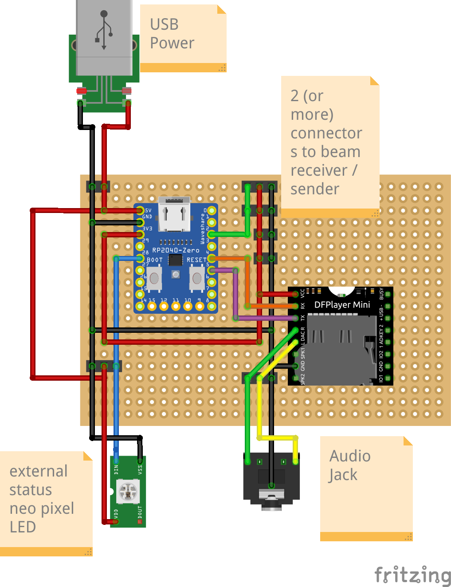

# trigger-tune
Open-source audio player triggered by light beams

## Components
- RP2040 (Zero)
- DFPlayer Mini
- USB Connector
- WS2812 (NeoPixel LED)
- Audio Jack
- Micro SD Card
- Perfboard
- Connectors / Cables
- Enclosure / Box

## Wiring Diagram

*Figure 1: Complete TagTune system with components*

## How-To

### Breadboard Prototyping
For initial testing, it is recommended to build the circuit on a breadboard first.

### Firmware Setup
1. Install **Thonny** IDE on your computer.
2. Flash the **MicroPython firmware** to the RP2040.  
   > **Firmware download:** [MicroPython for RP2040](https://micropython.org/download/rp2-pico/)
3. Copy all files from the `firmware` folder to the RP2040.

### ⚠️ Important: USB Power Handling
- **Do not** connect an external USB power source to the additional USB port while the RP2040 is connected to your computer via USB.
- Once the RP2040 is disconnected from the computer, the external USB port can be used to power all components. But for testing purpose you can use the USB Port of the RP2040.
- The external USB port will later be integrated into the enclosure.

## Third-Party Code and License

This project contains modified code from the [penguintutor/dfplayermini-pico](https://github.com/penguintutor/dfplayermini-pico) repository.

*   **Original Author:** [@PenguinTutor](https://www.penguintutor.com)
*   **Original Repository License:** **GNU General Public License v3.0** (GPL-3.0) – see full text in the original repository's `LICENSE` file.
*   **Modifications by:** ([@simonbln](https://github.com/simonbln))
*   **Date of modifications:** March 2026
*   **Nature of modifications:**
    1.  Updated `command.to_bytes(1)` to `command.to_bytes(1, 'big')` for compatibility with newer Python versions.
    2.  Fixed the return value parsing for the reset command to correctly handle the module's response.

This modified version is distributed under the same license terms (GPL-3.0). The complete license text is included in this repository as `LICENSE`.